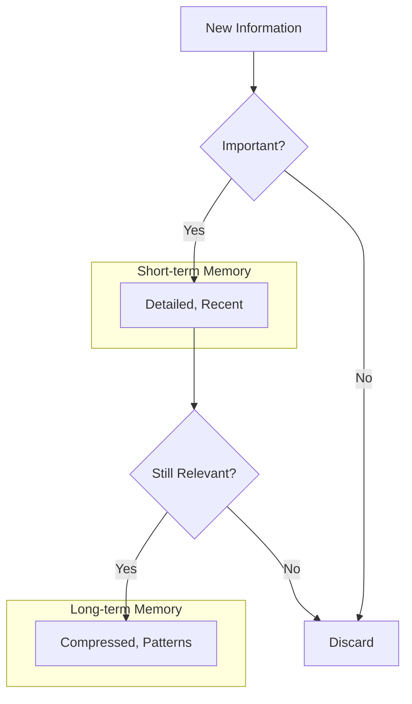

# Memory Bank Management Strategy

## Core Principles

1. **Space Efficiency**
   - Memory bank files should be concise and focused
   - Deleting irrelevant memories is encouraged and beneficial
   - Information should be stored at the appropriate level of detail

2. **Short-term vs. Long-term Memory**
   - **Short-term memory**: Detailed, recent, specific (activeContext.md, progress.md)
   - **Long-term memory**: Compressed, patterns, principles (systemPatterns.md, techContext.md, projectbrief.md)



## File-Specific Guidelines

### Short-term Memory Files

#### activeContext.md
- Focus on **current** work and recent changes
- Limit to last 1-2 work sessions
- Summarize test cases rather than listing each one
- Highlight active decisions and current challenges

#### progress.md
- Use tables for status tracking
- Summarize by category, not individual items
- Focus on high-level completion status
- Keep "What's Left to Build" focused on major items

### Long-term Memory Files

#### systemPatterns.md
- Focus on architectural patterns and design decisions
- Extract principles from implementation details
- Document the "why" behind decisions
- Avoid listing specific implementations

#### techContext.md
- Document technologies, libraries, and tools
- Focus on how they're used in the project
- Highlight constraints and requirements
- Avoid detailed version histories

#### projectbrief.md
- Maintain core project goals and requirements
- Update only when project scope changes
- Keep high-level architecture diagrams
- Serve as the foundation for all other files

## Compression Strategies

1. **Summarize Lists**
   - Replace exhaustive lists with summary statements
   - Use categories instead of individual items
   - Focus on patterns rather than instances

2. **Use Tables**
   - Convert narrative text to tables where appropriate
   - Track progress with percentages rather than detailed lists
   - Provide at-a-glance status information

3. **Reference External Files**
   - Link to PRDs instead of duplicating content
   - Reference test files rather than listing all test cases
   - Point to documentation rather than repeating it

4. **Regular Pruning**
   - Regularly review and compress memory bank files
   - Remove outdated or irrelevant information
   - Consolidate similar information across files

## "Compress Memory Bank" Trigger

When the trigger "compress memory bank" is used:

1. Review all memory bank files with compression as the primary goal
2. Apply the short-term vs. long-term memory strategy
3. Aggressively prune redundant or outdated information
4. Consolidate similar information across files
5. Report on the compression achieved (e.g., token reduction)

## Implementation in Custom Instructions

Add the following to the "Core Workflows" section of the custom instructions:

```markdown
### Memory Management
- Be mindful of space in memory bank files
- Deleting irrelevant memories is a good thing
- Follow short-term vs. long-term memory strategy:
  - Short-term memory (activeContext.md, progress.md): Detailed, recent, specific
  - Long-term memory (systemPatterns.md, techContext.md, projectbrief.md): Compressed, patterns, principles
- Apply this strategy on every interaction with the memory bank
- Use "compress memory bank" trigger to perform a compression run
```

Add the following to the "Documentation Updates" section:

```markdown
When compressing memory bank files:
1. Focus on patterns over instances
2. Use tables and summaries instead of exhaustive lists
3. Keep only the most relevant and recent information in short-term memory
4. Distill important insights into long-term memory
5. Delete outdated or redundant information
```
