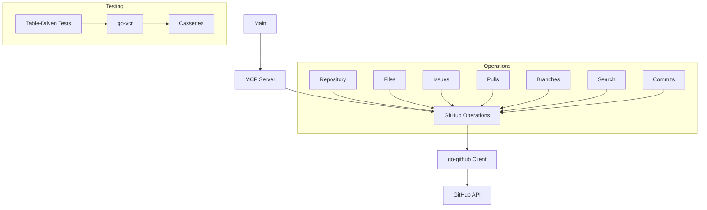

# GitHub MCP Server Port to Go - Project Brief

## Project Overview

This project involves porting an existing Model Context Protocol (MCP) server for GitHub from TypeScript to Go. The server will use the mcp-go library for MCP functionality and the go-github library for GitHub API interactions.

## Architecture



## Implementation Plan

### 1. Project Setup

- Create a Go module structure
- Set up dependencies (mcp-go, go-github, logrus)
- Create a basic server skeleton

### 2. Core Components

1. **Server Configuration**
   - Authentication handling
   - Error handling utilities with logrus
   - GitHub client initialization

2. **Tool Definitions**
   - Define all tools with proper schemas
   - Implement validation for tool inputs

3. **Operation Modules**
   - Repository operations
   - File operations
   - Issue operations
   - Pull request operations (including the new tools)
   - Branch operations
   - Search operations
   - Commit operations

### 3. Tool Implementations

We'll implement all tools from the TypeScript version, plus the additional requested tools:

**Repository Operations:**
- `search_repositories` - Search for GitHub repositories
- `create_repository` - Create a new GitHub repository
- `fork_repository` - Fork a GitHub repository

**File Operations:**
- `get_file_contents` - Get contents of a file or directory
- `create_or_update_file` - Create or update a single file
- `push_files` - Push multiple files in a single commit

**Issue Operations:**
- `create_issue` - Create a new issue
- `list_issues` - List issues with filtering options
- `update_issue` - Update an existing issue
- `add_issue_comment` - Add a comment to an issue
- `get_issue` - Get details of a specific issue

**Pull Request Operations:**
- `create_pull_request` - Create a new pull request
- `get_pull_request` - Get detailed information about a pull request (NEW)
- `get_pull_request_diff` - Get the diff of a pull request (NEW)

**Branch Operations:**
- `create_branch` - Create a new branch

**Search Operations:**
- `search_code` - Search for code across repositories
- `search_issues` - Search for issues and pull requests
- `search_users` - Search for users

**Commit Operations:**
- `list_commits` - Get list of commits for a branch

### 4. Error Handling

- Implement proper error handling using logrus
- Handle GitHub API errors, validation errors, authentication errors, etc.
- Provide clear error messages for troubleshooting

### 5. Testing

- Implement table-driven tests using go-vcr
- Create cassettes for each API interaction
- Test both success and error scenarios
- Structure tests to be maintainable and extensible

## Project Structure

```
github-mcp-go/
├── cmd/
│   └── github-mcp-go/
│       └── main.go
├── internal/
│   ├── server/
│   │   └── server.go
│   ├── github/
│   │   ├── client.go
│   │   ├── repository.go
│   │   ├── files.go
│   │   ├── issues.go
│   │   ├── pulls.go
│   │   ├── branches.go
│   │   ├── search.go
│   │   └── commits.go
│   └── errors/
│       └── errors.go
├── pkg/
│   └── tools/
│       ├── repository.go
│       ├── files.go
│       ├── issues.go
│       ├── pulls.go
│       ├── branches.go
│       ├── search.go
│       └── commits.go
├── test/
│   ├── fixtures/
│   └── tools/
│       ├── repository_test.go
│       ├── files_test.go
│       ├── issues_test.go
│       ├── pulls_test.go
│       ├── branches_test.go
│       ├── search_test.go
│       └── commits_test.go
├── go.mod
├── go.sum
└── README.md
