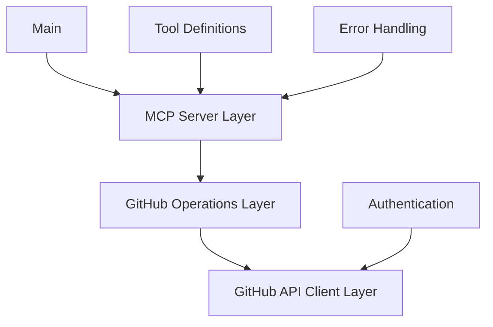

# System Patterns

## Architecture Overview

The GitHub MCP server follows a layered architecture with clear separation of concerns:



## Key Patterns

### 1. Dependency Injection

- GitHub client is injected into operation handlers
- Allows for easier testing and mocking
- Centralizes client configuration

```go
type RepositoryOperations struct {
    client *github.Client
    logger *logrus.Logger
}

func NewRepositoryOperations(client *github.Client, logger *logrus.Logger) *RepositoryOperations {
    return &RepositoryOperations{
        client: client,
        logger: logger,
    }
}
```

### 2. Command Pattern

- Each tool is implemented as a command
- Standardized input validation and error handling
- Consistent response formatting

```go
func (r *RepositoryOperations) SearchRepositories(ctx context.Context, query string, page, perPage int) (*mcp.CallToolResult, error) {
    // Implementation
}
```

### 3. Adapter Pattern

- Adapts GitHub API responses to MCP tool results
- Handles conversion between different data formats
- Provides consistent error handling

```go
func convertGitHubRepositoryToToolResult(repo *github.Repository) *mcp.CallToolResult {
    // Implementation
}
```

### 4. Factory Pattern

- Tool factories create and register tools with the MCP server
- Centralizes tool creation and configuration
- Simplifies adding new tools

```go
func RegisterRepositoryTools(server *server.MCPServer, operations *RepositoryOperations) {
    // Register tools
}
```

## Error Handling Strategy

- Structured error types for different error categories
- Consistent error formatting for MCP responses
- Detailed logging with context

```go
type GitHubError struct {
    StatusCode int
    Message    string
    Response   interface{}
}
```

## Testing Strategy

### Approach

- **Iterative Testing**: Implement one test case at a time, ensuring it works completely before moving to the next
- **Table-Driven Tests**: Define test cases in a structured way for each tool
- **HTTP Interaction Recording**: Use go-vcr to record and replay HTTP interactions
- **Golden Files**: Store expected results in golden files for comparison
- **Test Fixtures**: Create reusable test fixtures for common scenarios
- **Mocking**: Mock GitHub client for unit tests when appropriate
- **Integration Tests**: Use recorded API responses for integration testing

### Test Structure

```go
func TestPullRequest(t *testing.T) {
    testCases := []TestCase{
        {
            Name: "SuccessfulCreation",
            Tool: "create_pull_request",
            Input: map[string]interface{}{
                "owner": OWNER,
                "repo":  REPO,
                "title": "Test PR",
                "body":  "Test PR body",
                "head":  BRANCH,
                "base":  "main",
                "draft": false,
            },
        },
        // Additional test cases (commented out until ready to implement)
    }

    for _, tc := range testCases {
        t.Run(tc.Name, func(t *testing.T) {
            RunTest(t, tc)
        })
    }
}
```

### Test Execution

```go
func RunTest(t *testing.T, tc TestCase) {
    // Create test server with VCR recorder
    s := createTestServer(t, *record)

    // Execute the test tool
    actual, testErr := executeTestTool(testCtx, handler, tc.Tool, tc.Input)
    
    // Compare with golden file
    if *golden {
        // Update golden file
        writeGoldenFile(goldenFile, actual)
    } else {
        // Read golden file and compare
        expected, _ := readGoldenFile(goldenFile)
        // Compare actual and expected results
    }
}
```

### VCR Recording

- Record mode: Captures real HTTP interactions with GitHub API
- Replay mode: Uses recorded interactions for deterministic testing
- Sanitization: Removes sensitive information like auth tokens from cassettes

### Golden Files

- Store expected test results in JSON format
- Update with `-golden` flag when test behavior changes
- Compare actual results against golden files during testing
