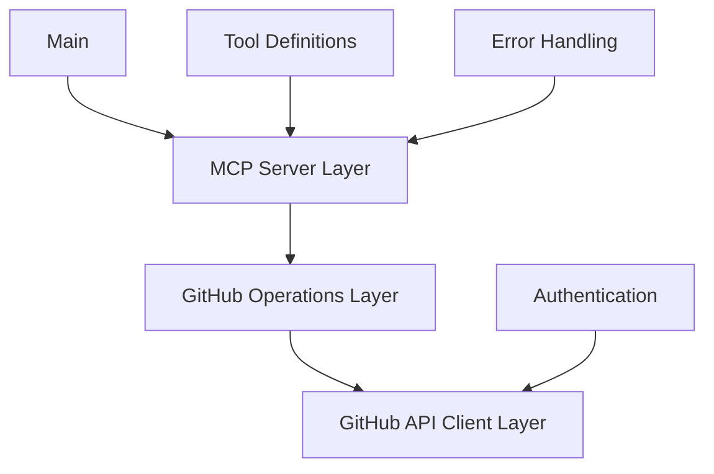
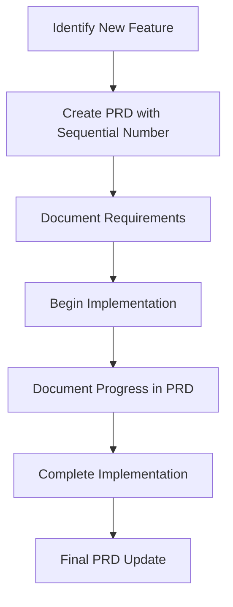

# System Patterns

## Architecture Overview

The GitHub MCP server follows a layered architecture with clear separation of concerns:



## Key Patterns

### 1. Dependency Injection

- GitHub client is injected into operation handlers
- Allows for easier testing and mocking
- Centralizes client configuration

```go
type RepositoryOperations struct {
    client *github.Client
    logger *logrus.Logger
}

func NewRepositoryOperations(client *github.Client, logger *logrus.Logger) *RepositoryOperations {
    return &RepositoryOperations{
        client: client,
        logger: logger,
    }
}
```

### 2. API Requirement Handling

- Handle external API requirements transparently
- Provide sensible defaults for required parameters
- Allow explicit overrides through tool parameters

Example from search_issues tool:
```go
// Process the type parameter
lowerQuery := strings.ToLower(query)
if !hasType || itemType == "" {
    // Default to "issue" if not specified
    itemType = "issue"
}

// Validate and normalize the type
switch strings.ToLower(itemType) {
case "issue":
    if !strings.Contains(lowerQuery, "is:issue") {
        queryParts = append(queryParts, "is:issue")
    }
case "pull-request", "pr":
    if !strings.Contains(lowerQuery, "is:pr") && !strings.Contains(lowerQuery, "is:pull-request") {
        queryParts = append(queryParts, "is:pull-request")
    }
default:
    return mcp.NewToolResultError(errors.FormatGitHubError(
        errors.NewInvalidArgumentError("type must be either 'issue' or 'pull-request'"))), nil
}
```

### 2. Command Pattern

- Each tool is implemented as a command
- Standardized input validation and error handling
- Consistent response formatting

```go
func (r *RepositoryOperations) SearchRepositories(ctx context.Context, query string, page, perPage int) (*mcp.CallToolResult, error) {
    // Implementation
}
```

### 3. Adapter Pattern

- Adapts GitHub API responses to MCP tool results
- Handles conversion between different data formats
- Provides consistent error handling

```go
func convertGitHubRepositoryToToolResult(repo *github.Repository) *mcp.CallToolResult {
    // Implementation
}
```

### 4. Factory Pattern

- Tool factories create and register tools with the MCP server
- Centralizes tool creation and configuration
- Simplifies adding new tools

```go
func RegisterRepositoryTools(server *server.MCPServer, operations *RepositoryOperations) {
    // Register tools
}
```

### 5. Functional Grouping Pattern

- Group related tools and operations by functionality
- Consolidate similar operations in a single file
- Maintain clear separation between different resource types

Example:
```go
// All search-related operations are in pkg/github/search.go
type SearchOperations struct {
    client *Client
    logger *logrus.Logger
}

// All search-related tools are in pkg/tools/search.go
func RegisterSearchTools(s *Server) {
    // Register search_code, search_issues, search_commits, search_repositories
}
```

## Error Handling Strategy

- Structured error types for different error categories
- Consistent error formatting for MCP responses
- Detailed logging with context

```go
type GitHubError struct {
    StatusCode int
    Message    string
    Response   interface{}
}
```

## Feature Development Workflow

### Project Requirement Documents (PRDs)

- Each significant feature begins with a Project Requirement Document
- PRDs are stored in the `prds/` directory
- PRDs are numbered sequentially (e.g., `001-action-tools`, `002-feature-name`)
- PRDs document both requirements and implementation progress
- Implementation status is tracked within each PRD



### PRD Structure

- **Overview**: Brief description of the feature
- **Background**: Context and motivation
- **Requirements**: Detailed specifications
- **Implementation Details**: Technical approach
- **Testing Strategy**: How the feature will be tested
- **Progress**: Current implementation status
- **Future Considerations**: Potential enhancements

### PRD-Based Development Process

1. Create a new PRD with the next sequential number
2. Document requirements thoroughly before implementation
3. Update the PRD with implementation progress
4. Use the PRD to track what's completed and what's next
5. Finalize the PRD when implementation is complete

## Testing Strategy

### Approach

- **Iterative Testing**: Implement one test case at a time, ensuring it works completely before moving to the next
- **Table-Driven Tests**: Define test cases in a structured way for each tool
- **HTTP Interaction Recording**: Use go-vcr to record and replay HTTP interactions
- **Golden Files**: Store expected results in golden files for comparison
- **Test Fixtures**: Create reusable test fixtures for common scenarios
- **Mocking**: Mock GitHub client for unit tests when appropriate
- **Integration Tests**: Use recorded API responses for integration testing

### Test Structure

```go
func TestPullRequest(t *testing.T) {
    testCases := []TestCase{
        {
            Name: "SuccessfulCreation",
            Tool: "create_pull_request",
            Input: map[string]interface{}{
                "owner": OWNER,
                "repo":  REPO,
                "title": "Test PR",
                "body":  "Test PR body",
                "head":  BRANCH,
                "base":  "main",
                "draft": false,
            },
        },
        // Additional test cases (commented out until ready to implement)
    }

    for _, tc := range testCases {
        t.Run(tc.Name, func(t *testing.T) {
            RunTest(t, tc)
        })
    }
}
```

### Test Organization

Tests are organized by functionality and grouped together in test files:

```go
// All search-related tests are in pkg/tools/search_test.go
func TestSearch(t *testing.T) {
    testCases := []*TestCase{
        // search_repositories test cases
        {
            Name: "BasicSearch",
            Tool: "search_repositories",
            Input: map[string]interface{}{
                "query": "language:go",
            },
        },
        
        // search_code test cases
        {
            Name: "BasicCodeSearch",
            Tool: "search_code",
            Input: map[string]interface{}{
                "query": "function",
            },
        },
        
        // search_issues test cases
        {
            Name: "BasicIssueSearch",
            Tool: "search_issues",
            Input: map[string]interface{}{
                "query": "bug",
                "type":  "issue",
            },
        },
        
        // search_commits test cases
        {
            Name: "BasicCommitSearch",
            Tool: "search_commits",
            Input: map[string]interface{}{
                "query": "fix bug",
            },
        },
    }
    
    // Run all test cases
    for _, tc := range testCases {
        t.Run(tc.Name, func(t *testing.T) {
            RunTest(t, tc)
        })
    }
}
```

### Test Execution

```go
func RunTest(t *testing.T, tc TestCase) {
    // Create test server with VCR recorder
    s := createTestServer(t, *record)

    // Execute the test tool
    actual, testErr := executeTestTool(testCtx, handler, tc.Tool, tc.Input)
    
    // Compare with golden file
    if *golden {
        // Update golden file
        writeGoldenFile(goldenFile, actual)
    } else {
        // Read golden file and compare
        expected, _ := readGoldenFile(goldenFile)
        // Compare actual and expected results
    }
}
```

### VCR Recording

- Record mode: Captures real HTTP interactions with GitHub API
- Replay mode: Uses recorded interactions for deterministic testing
- Sanitization: Removes sensitive information like auth tokens from cassettes

### Golden Files

- Store expected test results in JSON format
- Update with `-golden` flag when test behavior changes
- Compare actual results against golden files during testing
