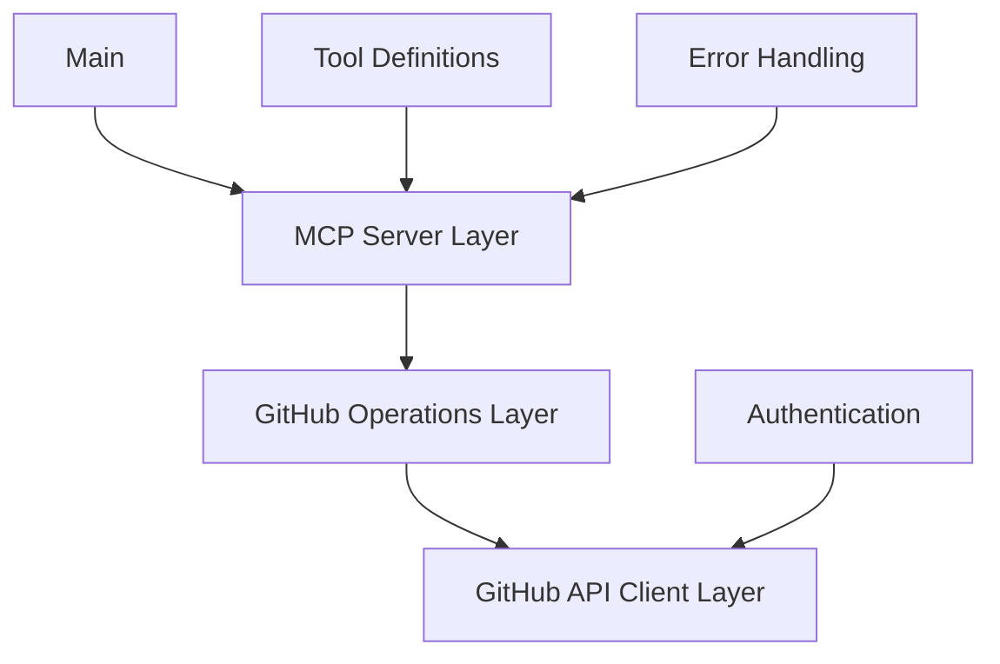

# System Patterns

## Architecture Overview

The GitHub MCP server follows a layered architecture with clear separation of concerns:



## Key Patterns

### 1. Dependency Injection

- GitHub client is injected into operation handlers
- Allows for easier testing and mocking
- Centralizes client configuration

```go
type RepositoryOperations struct {
    client *github.Client
    logger *logrus.Logger
}

func NewRepositoryOperations(client *github.Client, logger *logrus.Logger) *RepositoryOperations {
    return &RepositoryOperations{
        client: client,
        logger: logger,
    }
}
```

### 2. Command Pattern

- Each tool is implemented as a command
- Standardized input validation and error handling
- Consistent response formatting

```go
func (r *RepositoryOperations) SearchRepositories(ctx context.Context, query string, page, perPage int) (*mcp.CallToolResult, error) {
    // Implementation
}
```

### 3. Adapter Pattern

- Adapts GitHub API responses to MCP tool results
- Handles conversion between different data formats
- Provides consistent error handling

```go
func convertGitHubRepositoryToToolResult(repo *github.Repository) *mcp.CallToolResult {
    // Implementation
}
```

### 4. Factory Pattern

- Tool factories create and register tools with the MCP server
- Centralizes tool creation and configuration
- Simplifies adding new tools

```go
func RegisterRepositoryTools(server *server.MCPServer, operations *RepositoryOperations) {
    // Register tools
}
```

## Error Handling Strategy

- Structured error types for different error categories
- Consistent error formatting for MCP responses
- Detailed logging with context

```go
type GitHubError struct {
    StatusCode int
    Message    string
    Response   interface{}
}
```

## Testing Strategy

- Table-driven tests for each tool
- HTTP interaction recording with go-vcr
- Mocking of GitHub client for unit tests
- Integration tests with recorded API responses

```go
func TestSearchRepositories(t *testing.T) {
    // Test cases
    testCases := []struct {
        name     string
        query    string
        wantErr  bool
        expected *github.RepositoriesSearchResult
    }{
        // Test cases
    }
    
    // Test implementation
}
